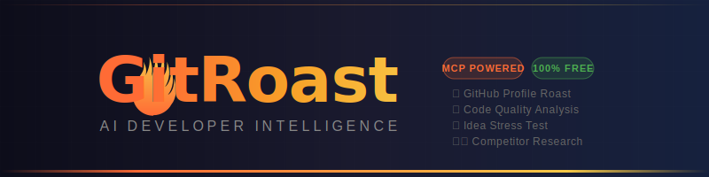
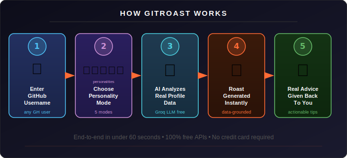
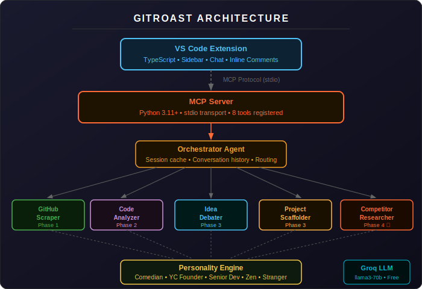

<div align="center">



<br/>

[](https://python.org)
[](https://modelcontextprotocol.io)
[](https://console.groq.com)
[](https://marketplace.visualstudio.com)
[](LICENSE)
[](CONTRIBUTING.md)
[](README.md#get-your-free-api-keys)

**The most brutally honest, data-driven developer intelligence tool on the internet.**  
Real GitHub data. Real roasts. Real competitor research. Zero BS. 100% free APIs.

[**🚀 Quick Start**](#-quick-start-5-minutes-all-free) · [**🎮 Usage**](#-usage-examples) · [**🛠️ Tools**](#-mcp-tools-reference) · [**📁 Structure**](#-project-structure) · [**🤝 Contributing**](#-contributing)

</div>

---

## 🤔 What Is GitRoast?

GitRoast is an **MCP (Model Context Protocol) server** that connects to any compatible AI agent (Claude Desktop, Cursor, Windsurf, VS Code) and gives it full developer intelligence superpowers.

It doesn't lie. It doesn't guess. It uses **real GitHub data** — commits, PRs, issues, READMEs, code files — and a free Groq LLM to generate:

- 🔥 **A personalized developer roast** grounded in specific data facts
- 🔬 **Real static code analysis** — pylint scores, cyclomatic complexity, secret detection
- 🧠 **Multi-agent idea debates** — three AI agents arguing for and against your idea
- 🏗️ **Full project scaffolds** — folder structure, tech stack, 4-week roadmap
- 🕵️ **Competitor intelligence** — GitHub Search API, differentiation angles, your wedge

> Built with: Python 3.11+, MCP SDK, PyGitHub, Groq (llama3-70b-8192), Pydantic v2, Rich.  
> **100% free APIs. No credit card required anywhere.**

---

## ✨ Features

| Feature | Status | Description |
|---------|--------|-------------|
| 🔍 **Deep GitHub Scraping** | ✅ Live | Repos, commits, PRs, issues, READMEs, languages — up to 20 repos |
| 🔥 **AI Roast Generation** | ✅ Live | Groq-powered, personality-aware, every point backed by a real number |
| 💬 **Multi-turn Follow-ups** | ✅ Live | Ask questions without re-fetching GitHub — session cached |
| 🎭 **5 Personality Modes** | ✅ Live | Comedian, YC Founder, Senior Dev, Zen Mentor, Anonymous Stranger |
| 🗂️ **Session Caching** | ✅ Live | Profiles cached for instant follow-ups in the same session |
| 🔨 **Code Quality Analysis** | ✅ Live | pylint + radon complexity + AST — secrets, nesting, bare excepts, missing tests |
| 🧠 **Idea Stress Tester** | ✅ Live | 3-agent debate: The Believer vs The Destroyer, resolved by The Judge |
| 🏗️ **Project Scaffolder** | ✅ Live | Full folder structure, runnable starter files, 4-week roadmap, optional GitHub repo creation |
| 💬 **Inline Code Comments** | ✅ Live | Color-coded review decorations in VS Code with Problems panel integration |
| 🕵️ **Competitor Researcher** | ✅ **Live** | GitHub Search API + Groq synthesis — competitors, weaknesses, differentiation angles, your wedge |

---

<div align="center">

</div>

---

## 🚀 Quick Start (5 minutes, all free)

### 1. Clone & Install

```bash
git clone https://github.com/yourusername/gitroast.git
cd gitroast

python -m venv .venv

# Windows:
.venv\Scripts\activate
# macOS/Linux:
source .venv/bin/activate

pip install -r requirements.txt
```

### 2. Get Your Free API Keys

| Key | Where | Time |
|-----|-------|------|
| `GROQ_API_KEY` | [console.groq.com](https://console.groq.com) → Create API Key | 30 seconds |
| `GITHUB_TOKEN` | [github.com/settings/tokens](https://github.com/settings/tokens) → New token (classic) | 1 minute |

**GitHub token scopes needed:** `read:user`, `public_repo` — that's it.

### 3. Configure Environment

```bash
cp .env.example .env
```

Edit `.env`:

```env
GROQ_API_KEY=gsk_your_groq_key_here
GITHUB_TOKEN=ghp_your_github_token_here
```

### 4. Connect to Claude Desktop (or any MCP agent)

Add this to your Claude Desktop config (`claude_desktop_config.json`):

```json
{
  "mcpServers": {
    "gitroast": {
      "command": "python",
      "args": ["-m", "mcp_server.server"],
      "cwd": "/absolute/path/to/gitroast"
    }
  }
}
```

**Config file location:**
- **Windows:** `%APPDATA%\Claude\claude_desktop_config.json`
- **macOS:** `~/Library/Application Support/Claude/claude_desktop_config.json`

Restart Claude Desktop → GitRoast tools appear in the tool list.

### 5. (Optional) Install the VS Code Extension

Open VS Code in the `vscode_extension/` directory and press `F5` to run in development mode.

In the sidebar, set `gitroast.mcpServerPath` to your GitRoast folder path.

**Keyboard shortcuts:**
- `Ctrl+Shift+G` / `Cmd+Shift+G` → Analyze GitHub Profile
- `Ctrl+Shift+R` / `Cmd+Shift+R` → Add Inline Code Comments

---

## 🎮 Usage Examples

### 🔥 Roast a Developer

```
analyze_developer(username="torvalds", personality="comedian")
analyze_developer(username="addyosmani", personality="yc_founder")
```

### 🔬 Analyze Code Quality

```
analyze_code_quality(username="facebook", max_repos=3, personality="senior_dev")
```

### 🧠 Stress Test an Idea

```
stress_test_idea(idea="A VS Code extension that roasts your GitHub profile using AI")
```

### 🏗️ Scaffold a Project

```
scaffold_project(idea="CLI tool for analyzing GitHub commit patterns", create_repo=false)
```

### 🕵️ Research Competitors

```
research_competitors(idea="VS Code extension that analyzes code quality using AI", personality="yc_founder")
```

Output: competitor table, weaknesses, differentiation angles, your wedge, strategic recommendation.

### 💬 Ask Follow-up Questions

```
ask_followup(question="Which of their repos has the best README?")
ask_followup(question="What language should they focus on next?")
```

### 🔄 Switch Personality

```
set_personality(personality="zen_mentor")
```

---

## 🎭 The 5 Personality Modes

| Mode | Emoji | Vibe | Example Output |
|------|-------|------|----------------|
| `comedian` | 🎤 | Stand-up roast | *"17 commits titled 'fix'. Fix WHAT? File a police report."* |
| `yc_founder` | 🚀 | Startup intensity | *"Your commit frequency is not investor-ready. We need to talk metrics."* |
| `senior_dev` | 😤 | Tired veteran | *"...I've seen this pattern since 2009. It's not nostalgia, it's concern."* |
| `zen_mentor` | 🧘 | Tough love | *"Your gap of 47 days speaks to something. Let's examine that."* |
| `stranger` | 👻 | Unfiltered chaos | *"Zero stars. Two years. The algorithm has rendered its verdict."* |

---

## 🕵️ The Competitor Researcher

GitRoast's **Competitor Intelligence Engine** searches GitHub for projects similar to your idea — no paid APIs required.

**How it works:**
1. Extracts smart keywords from your idea description
2. Runs 3 targeted GitHub searches (top stars, keyword combos, tool variants)
3. Analyzes each competitor: stars, activity, README quality, issue backlog, topics
4. Auto-detects weaknesses: abandoned, poor docs, no install instructions, overwhelmed maintainers
5. Finds differentiation angles: what's missing from ALL competitors
6. Groq synthesizes into a full intelligence report

**Output includes:**
- 📊 Competitor table with stars, activity, top weakness
- 🎯 Differentiation angles with evidence and strength rating
- 🏹 **Your Wedge** — the single most important differentiator (one sentence, pitch-deck ready)
- 📋 Strategic Recommendation: Build it / Niche down / Find a gap / Reconsider
- 📅 3 Things To Do This Week

> *"3 people built this. None of them have X. That's your wedge."*

---

## 🧠 The Debate Arena

GitRoast's **Idea Stress Tester** is a 3-agent multi-AI debate system.

```
User pitches idea
      ↓
🟢 Agent 1: The Believer   → "Here's every reason this could WIN"
🔴 Agent 2: The Destroyer  → "Here's every reason this will FAIL"
      ↓
⚖️  Agent 3: The Judge     → Verdict + Refined Idea + Next Steps
```

**Sample output:**

```
## 🟢 The Case FOR: "AI-powered code review VS Code extension"
### The Unfair Advantage
The $12B code review market is dominated by GitHub's generic suggestions.
A personality-driven, developer-identity-aware tool is a completely different product.

Confidence Score: 8/10

---

## 🔴 The Case AGAINST
### The Graveyard
GitHub Copilot, CodeGuru, SonarQube — all deeply entrenched.
"AI code review" is a crowded pitch at every accelerator right now.

Confidence Score: 6/10

---

## ⚖️ The Verdict: BUILD IT — Niche Down
The Destroyer misjudged the personality angle. Roasting is a different emotional
contract than reviewing — it drives deeper engagement.
Refined idea: GitRoast for teams — roast your PR before it goes to review.
```

---

## 🔬 What Data Does GitRoast Actually Analyze?

### GitHub Profile (up to 20 repos)
- Stars, forks, language, description per repo
- README quality score (0–10): badges, screenshots, install/usage sections, word count
- Test file detection
- Days since last commit, commit count per repo

### Commit Analysis (last 90 days)
- Total commits and weekly average
- Bad commit message detection (30+ lazy patterns: "fix", "wip", ".", "asdf"...)
- Late-night commits (11pm–4am), weekend commits
- Most active coding hour, longest gap between commits

### Pull Request Analysis
- Total, merged, and open PR counts
- PR description quality (< 20 chars = "no description")
- Average days to merge

### Issue Analysis
- Open vs. closed ratio, issues open > 30 days
- Issues with no labels, average days to close

### Code Quality (Static Analysis)
- **pylint** — import errors, undefined names, duplicate code
- **radon** — cyclomatic complexity per function (A–F grades)
- **AST** — hardcoded secrets, bare except, deeply nested code
- Missing test files, TODO/FIXME density

### Competitor Research
- GitHub search across 3 targeted queries
- Stars, forks, last activity, open issues per competitor
- README word count and install instructions check
- Topic tags, language distribution

---

## 📁 Project Structure

```
gitroast/
├── assets/
│   ├── logo.svg                   # App icon (pure SVG)
│   ├── banner.svg                 # README header banner
│   ├── architecture.svg           # System architecture diagram
│   └── demo_flow.svg              # 5-step user flow diagram
├── .github/
│   └── workflows/ci.yml           # GitHub Actions CI
├── mcp_server/
│   ├── server.py                  # MCP entry point — 8 registered tools
│   ├── orchestrator.py            # Session cache, conversation history, debate context
│   ├── tools/
│   │   ├── github_scraper.py      # ★ Core — full GitHub profile analysis engine
│   │   ├── code_analyzer.py       # ★ Phase 2 — pylint + radon + AST analysis
│   │   ├── idea_debater.py        # ★ Phase 3 — multi-agent debate system
│   │   ├── scaffolder.py          # ★ Phase 3 — project scaffolding engine
│   │   └── competitor_researcher.py  # ★ Phase 4 — GitHub search + Groq synthesis
│   ├── personality/
│   │   └── engine.py              # 5 persona wrappers with style injection
│   └── utils/
│       └── helpers.py             # Formatting utilities
├── vscode_extension/
│   ├── src/
│   │   ├── extension.ts           # Extension entry — 9 commands, status bar, welcome
│   │   ├── sidebar.ts             # Production sidebar with loading states + capabilities
│   │   ├── chat_panel.ts          # Persistent chat panel with history
│   │   └── inline_comments.ts     # Inline code review decorations
│   ├── media/
│   │   ├── logo.svg               # Extension icon (SVG)
│   │   └── logo_dark.svg          # Dark theme icon
│   └── package.json               # Extension manifest — v0.4.0
├── tests/
│   ├── test_github_scraper.py     # 7 tests — all mocked
│   ├── test_personality.py        # 9 tests
│   ├── test_code_analyzer.py      # Code quality analysis tests
│   ├── test_idea_debater.py       # Debate system tests
│   └── test_scaffolder.py         # Scaffolder tests
├── .env.example                   # Copy to .env and fill your keys
├── requirements.txt
└── pyproject.toml
```

---

## 🛠️ MCP Tools Reference

| Tool | Phase | Inputs | What It Does |
|------|-------|--------|--------------|
| `analyze_developer` | 1 ✅ | `username`, `personality` | Full GitHub profile roast with real data |
| `set_personality` | 1 ✅ | `personality` | Switch roast mode for the session |
| `ask_followup` | 1 ✅ | `question` | Follow-up Q&A without re-fetching GitHub |
| `clear_session` | 1 ✅ | — | Clear session cache and conversation history |
| `analyze_code_quality` | 2 ✅ | `username`, `personality`, `max_repos` | pylint + radon + AST across repos |
| `stress_test_idea` | 3 ✅ | `idea`, `context`, `personality` | 3-agent debate (Believer / Destroyer / Judge) |
| `scaffold_project` | 3 ✅ | `idea`, `create_repo`, `personality` | Full project scaffold + optional GitHub repo |
| `research_competitors` | 4 ✅ | `idea`, `personality` | GitHub Search + competitor analysis + your wedge |

---

## 🏗️ Architecture

<div align="center">

</div>

---

## ⚙️ Configuration

| Variable | Default | Description |
|----------|---------|-------------|
| `GROQ_API_KEY` | required | Free at [console.groq.com](https://console.groq.com) — no credit card |
| `GITHUB_TOKEN` | recommended | 5,000 req/hr vs 60/hr without — get at [github.com/settings/tokens](https://github.com/settings/tokens) |
| `GROQ_MODEL` | `llama3-70b-8192` | Groq model — free tier model |
| `DEBUG` | `true` | Enable debug logging via loguru |

---

## 🧪 Running Tests

```bash
# All tests (no real API calls — fully mocked)
pytest tests/ -v

# Specific file
pytest tests/test_personality.py -v
pytest tests/test_github_scraper.py -v

# With coverage
pip install pytest-cov
pytest tests/ --cov=mcp_server --cov-report=term-missing
```

---

## 🛠️ Running Modules Directly (CLI)

```bash
# Test the scraper standalone
python -m mcp_server.tools.github_scraper

# Test the competitor researcher
python -m mcp_server.tools.competitor_researcher

# Test the idea debater
python -m mcp_server.tools.idea_debater

# Run the full MCP server (stdio mode)
python -m mcp_server.server
```

---

## 🗺️ Roadmap

- [x] **Phase 1** — GitHub scraper, roast engine, MCP server, 5 personalities, VS Code skeleton
- [x] **Phase 2** — Code quality analyzer: pylint + radon + AST, scored 1-10 per repo; VS Code extension UI
- [x] **Phase 3** — Idea Stress Tester (3-agent debate) + Project Scaffolder
- [x] **Phase 4** — Competitor Researcher (GitHub Search + Groq synthesis) + VS Code polish + SVG assets + production README
- [ ] **Phase 5** — Real-time file watching, team-mode roasting, Slack/Discord integration

---

## 🤝 Contributing

Contributions are welcome! This is an open, community-driven project.

```bash
# Fork and clone
git checkout -b feature/your-feature-name

# Make your changes
pytest tests/ -v   # All tests must pass

git commit -m "feat: add your feature with a real commit message"
git push origin feature/your-feature-name
# Open a PR — describe what you did and why
```

**Good first issues:**
- Add more bad commit message patterns to `BAD_MESSAGES` in `github_scraper.py`
- Add a new personality mode to `personality/engine.py`
- Improve the competitor weakness detection heuristics
- Add a new differentiation angle detector
- Write tests for `competitor_researcher.py`

---

## ⚖️ License

MIT — see [LICENSE](LICENSE). Use it, fork it, ship it. Just don't make it mean.

---

## 🙏 Built With

| Tool | Role |
|------|------|
| [MCP SDK](https://github.com/modelcontextprotocol/python-sdk) | Protocol that makes this work with any AI agent |
| [Groq](https://console.groq.com) | Blazing fast, genuinely free LLM inference (llama3-70b-8192) |
| [PyGitHub](https://github.com/PyGithub/PyGithub) | GitHub API wrapper — profile scraping + search |
| [Pydantic v2](https://docs.pydantic.dev) | Data validation for all models |
| [Rich](https://github.com/Textualize/rich) | Beautiful terminal output and status displays |
| [Loguru](https://github.com/Delgan/loguru) | Structured logging throughout |
| [pylint](https://pylint.readthedocs.io) | Static analysis for code quality scoring |
| [radon](https://radon.readthedocs.io) | Cyclomatic complexity analysis |

---

<div align="center">

**Built with 🔥 by developers who have seen too many `git commit -m "fix"` messages.**

*GitRoast roasts you because it cares.*

[](https://github.com/yourusername/gitroast)

</div>
